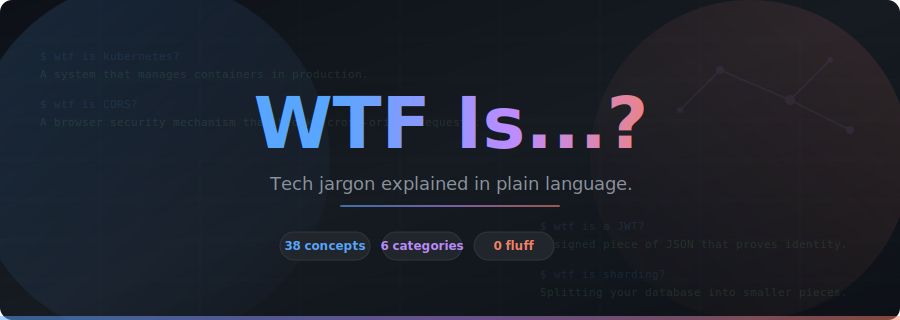

<p align="center">
  
</p>

<p align="center">
  <strong>Tech jargon explained in plain language.</strong><br>
  No fluff, no history lessons, no "in modern computing paradigms..."<br>
  Just what the thing is, why it exists, and a quick diagram when it helps.
</p>

<p align="center">
  <a href="#concepts"></a>
  <a href="#categories"></a>
  <a href="CONTRIBUTING.md"></a>
  <a href="LICENSE"></a>
</p>

<p align="center">
  <a href="https://github.com/andreahlert/wtf-is/stargazers"></a>
  <a href="https://github.com/andreahlert/wtf-is/network/members"></a>
</p>

---

## How it works

> You search. You find. You understand. In 30 seconds.

Every concept follows the same format:

```
# WTF is [Thing]?

[2-4 sentences. Plain language. No prerequisites.]

[ASCII diagram that actually clarifies something]

Examples: real tools and products that use this
```

---

<a id="categories"></a>

## Concepts

<a id="concepts"></a>

<details open>
<summary><b>Infrastructure & DevOps</b> <code>9 concepts</code></summary>
<br>

| Concept | One-liner |
|---------|-----------|
| [Container](concepts/container.md) | Your app in a box that runs the same everywhere |
| [Kubernetes](concepts/kubernetes.md) | Manages containers so you don't babysit servers |
| [Service Mesh](concepts/service-mesh.md) | Invisible layer handling traffic between services |
| [Infrastructure as Code](concepts/infrastructure-as-code.md) | Config files instead of clicking cloud dashboards |
| [CI/CD](concepts/ci-cd.md) | Auto-build, auto-test, auto-deploy on every push |
| [GitOps](concepts/gitops.md) | Git repo as the single source of truth for infra |
| [Reverse Proxy](concepts/reverse-proxy.md) | Server that sits in front of your backend |
| [Load Balancer](concepts/load-balancer.md) | Spreads traffic across multiple servers |
| [CDN](concepts/cdn.md) | Cached copies of your stuff, close to users worldwide |

</details>

<details open>
<summary><b>Architecture & Patterns</b> <code>9 concepts</code></summary>
<br>

| Concept | One-liner |
|---------|-----------|
| [Microservices](concepts/microservices.md) | Small independent services instead of one big app |
| [Monorepo](concepts/monorepo.md) | Multiple projects, one Git repo |
| [Event Sourcing](concepts/event-sourcing.md) | Store events, not state. Replay to get current data |
| [CQRS](concepts/cqrs.md) | Separate models for reading and writing data |
| [Eventual Consistency](concepts/eventual-consistency.md) | Data syncs across replicas... eventually |
| [Circuit Breaker](concepts/circuit-breaker.md) | Stop calling a failing service, give it time to recover |
| [Idempotency](concepts/idempotency.md) | Same operation, same result, no matter how many times |
| [Saga Pattern](concepts/saga-pattern.md) | Multi-service transactions with undo steps |
| [Sidecar Pattern](concepts/sidecar-pattern.md) | Helper container running next to your app |

</details>

<details open>
<summary><b>Networking & Protocols</b> <code>9 concepts</code></summary>
<br>

| Concept | One-liner |
|---------|-----------|
| [WebSocket](concepts/websocket.md) | Persistent two-way connection between client and server |
| [gRPC](concepts/grpc.md) | Fast binary RPC framework, not human-readable |
| [GraphQL](concepts/graphql.md) | Ask for exactly the data you need, nothing more |
| [OAuth 2.0](concepts/oauth.md) | Let apps access your account without your password |
| [JWT](concepts/jwt.md) | Signed JSON token that proves identity |
| [mTLS](concepts/mtls.md) | Both sides verify certificates, not just the server |
| [CORS](concepts/cors.md) | Browser blocks cross-origin requests unless server allows it |
| [CIDR](concepts/cidr.md) | Compact notation for IP address ranges |
| [DNS](concepts/dns.md) | Translates domain names into IP addresses |

</details>

<details open>
<summary><b>Data</b> <code>5 concepts</code></summary>
<br>

| Concept | One-liner |
|---------|-----------|
| [CAP Theorem](concepts/cap-theorem.md) | Pick two: consistency, availability, partition tolerance |
| [Sharding](concepts/sharding.md) | Split your database into smaller pieces |
| [Vector Database](concepts/vector-database.md) | Search by similarity, not exact match |
| [Data Lake vs Data Warehouse](concepts/data-lake-vs-data-warehouse.md) | Raw dump vs cleaned and structured |
| [ETL vs ELT](concepts/etl-vs-elt.md) | Transform before loading or after |

</details>

<details open>
<summary><b>Security</b> <code>3 concepts</code></summary>
<br>

| Concept | One-liner |
|---------|-----------|
| [Zero Trust](concepts/zero-trust.md) | Never trust, always verify, even inside the network |
| [RBAC](concepts/rbac.md) | Permissions assigned to roles, roles assigned to users |
| [Secret Manager](concepts/secret-manager.md) | Secure storage for API keys and passwords |

</details>

<details open>
<summary><b>AI/ML</b> <code>3 concepts</code></summary>
<br>

| Concept | One-liner |
|---------|-----------|
| [RAG](concepts/rag.md) | Search docs first, then ask the LLM |
| [Fine-tuning vs Prompting](concepts/fine-tuning-vs-prompting.md) | Train the model vs tell the model what to do |
| [Embedding](concepts/embedding.md) | Convert data into numbers that capture meaning |

</details>

---

## Want to contribute?

See [CONTRIBUTING.md](CONTRIBUTING.md). The short version:

1. Pick a concept that's missing
2. Write it using the format above (keep it short!)
3. Open a PR with the title `add: concept-name`

**Concept ideas that need someone to write them:**
`API Gateway` · `Terraform State` · `Blue-Green Deployment` · `Canary Release` · `Feature Flag` · `Rate Limiting` · `Backpressure` · `Dead Letter Queue` · `Webhook` · `SSE` · `OpenTelemetry` · `Bloom Filter` · `Consistent Hashing` · `Write-Ahead Log` · `Raft Consensus` · `Token Bucket` · `Chaos Engineering` · `SLA vs SLO vs SLI`

---

<p align="center">
  <sub>If this helped you, consider giving it a star. It helps others find it too.</sub>
</p>
